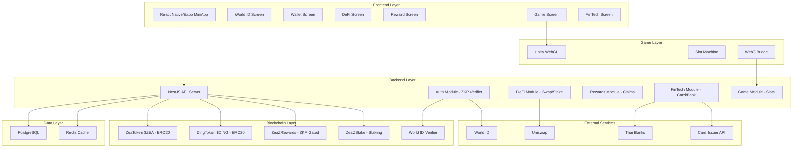

# ZeaZDev FiGaTect Super-App

## 🌟 Overview

ZeaZDev is an **OMEGA-TIER production-grade** Multi-Platform FiGaTect Super-App that seamlessly integrates:

- **DeFi** (Decentralized Finance): Wallet, Swap, Stake, Trade
- **GameFi** (Game Finance): Unity-powered slots with crypto rewards
- **FinTech** (Financial Technology): Real card issuance & Thai bank integration

Built as a **MiniApp for World App**, ZeaZDev uses **World ID Zero-Knowledge Proof (ZKP)** as the foundational identity verification layer for all high-value functions.

## 🏗️ Architecture



## 🛠️ Tech Stack

### Core Technologies
- **Monorepo**: pnpm workspaces with Turbo
- **Frontend**: React Native/Expo (Multi-platform: iOS, Android, Web)
- **Backend**: Node.js/NestJS (Production-grade API)
- **Game**: Unity WebGL (Crypto-integrated slots)
- **Contracts**: Solidity/Hardhat (Optimism L2)
- **Database**: PostgreSQL + Prisma ORM
- **Cache**: Redis
- **Identity**: World ID (Zero-Knowledge Proofs)

### Integrations
- **DeFi**: Uniswap V3, MetaMask
- **FinTech**: Stripe/Marqeta (Cards), Thai Bank Proxy
- **DevOps**: Docker, GitHub Actions

## 📦 Project Structure

```
zeazdev-omega/
├── apps/
│   ├── frontend-miniapp/         # React Native/Expo app
│   │   ├── src/
│   │   │   ├── screens/          # All UI screens
│   │   │   ├── config/           # i18n, constants
│   │   │   └── locales/          # EN/TH translations
│   │   └── package.json
│   └── backend/                  # NestJS API
│       ├── src/
│       │   ├── modules/          # Auth, DeFi, Rewards, FinTech, Game
│       │   ├── main.ts
│       │   └── app.module.ts
│       ├── prisma/
│       │   └── schema.prisma     # Full DB schema
│       └── package.json
├── packages/
│   ├── contracts/                # Smart contracts
│   │   ├── contracts/
│   │   │   ├── ZeaToken.sol      # $ZEA ERC20
│   │   │   ├── DingToken.sol     # $DING ERC20
│   │   │   ├── ZeaZRewards.sol   # ZKP rewards
│   │   │   └── ZeaZStake.sol     # Staking
│   │   ├── scripts/
│   │   │   └── deploy.ts
│   │   └── hardhat.config.ts
│   └── game-unity/               # Unity game
│       └── Assets/Scripts/
│           └── Web3Bridge.cs     # RN/Unity bridge
├── docker-compose.yml            # Postgres + Redis
├── package.json                  # Root workspace
├── turbo.json
├── .env.example
└── README.md
```

## 🚀 Features

### ✅ Core Features
- **World ID ZKP Verification**: Sybil-resistant identity for all rewards
- **Dual Tokenomics**: $ZEA (utility/governance) + $DING (game rewards)
- **MetaMask Integration**: Full wallet connectivity
- **Uniswap Swap**: Decentralized token exchange
- **Staking**: 10% APY on $ZEA
- **Daily Check-in**: ZKP-gated daily rewards
- **Airdrop**: One-time ZKP-gated claim
- **Referral Program**: Earn by inviting friends
- **Unity Slots**: Crypto-powered slot game
- **Real Card**: Apply for physical card
- **Thai Bank Integration**: Deposit/withdraw THB

### 🔐 Security
- **ZKP Verification**: World ID nullifier hash tracking
- **Reentrancy Guards**: All critical functions protected
- **Pausable Tokens**: Emergency controls
- **Production Hardened**: No placeholders or demo code

## 📥 Installation

### Prerequisites
- Docker Desktop
- Node.js 18+
- pnpm 8+
- Git
- Unity Hub (for game development)

### Quick Start

#### Ubuntu (Automated Installation)

```bash
# 1. Clone repository
git clone https://github.com/ZeaZDev/ZeaZDev-Omega.git
cd ZeaZDev-Omega

# 2. Run Ubuntu automated installer (installs all dependencies)
chmod +x install-ubuntu.sh
./install-ubuntu.sh

# 3. Access services
# - Frontend: http://localhost:8081
# - Backend: http://localhost:3000
# - Postgres: localhost:5432
# - Redis: localhost:6379
```

#### macOS / Other Linux / Windows (WSL2)

```bash
# 1. Clone repository
git clone https://github.com/ZeaZDev/ZeaZDev-Omega.git
cd ZeaZDev-Omega

# 2. Run automated installer (requires prerequisites installed)
chmod +x install.sh
./install.sh

# 3. Access services
# - Frontend: http://localhost:8081
# - Backend: http://localhost:3000
# - Postgres: localhost:5432
# - Redis: localhost:6379
```

### Manual Installation

```bash
# 1. Install dependencies
pnpm install

# 2. Start Docker services
docker compose up -d

# 3. Setup environment
cp .env.example .env
# Edit .env with your values

# 4. Run database migrations
pnpm db:migrate

# 5. Compile contracts (optional)
pnpm contracts:compile

# 6. Start development servers
pnpm dev
```

## 🎯 Usage

### Deploy Smart Contracts

```bash
cd packages/contracts
pnpm hardhat run scripts/deploy.ts --network optimism
# Update .env with deployed addresses
```

### Run Backend

```bash
cd apps/backend
pnpm dev
# API available at http://localhost:3000/api
```

### Run Frontend

```bash
cd apps/frontend-miniapp
pnpm start
# Expo dev server starts
```

### Build for Production

```bash
# Build all packages
pnpm build

# Build iOS
cd apps/frontend-miniapp
eas build --platform ios

# Build Android
eas build --platform android
```

## 🌐 Multi-Language Support

ZeaZDev supports:
- 🇬🇧 English (en)
- 🇹🇭 Thai (th)

Powered by react-i18next with dynamic language switching.

## 📚 Documentation

- [Architecture Deep Dive](./ARCHITECTURE.md)
- [Tokenomics](./TOKENOMICS.md)
- [Roadmap](./ROADMAP.md)
- [Contributing Guidelines](./CONTRIBUTING.md)
- [GitHub Setup Guide](./GITHUB-SETUP.md)
- [OS Requirements](./INSTALLER_OS_REQUIREMENTS.md)

## 🔗 Links

- **GitHub**: https://github.com/ZeaZDev/ZeaZDev-Omega
- **Documentation**: Coming soon
- **Community**: Coming soon

## 📄 License

Proprietary - All Rights Reserved

## 👥 Authors

**ZeaZDev Meta-Intelligence** (AI-Generated Omega Architecture)

---

**Version**: 1.0.0 (Omega Scaffolding)
**Status**: Production-Ready Foundation
**Last Updated**: 2025-11-08
