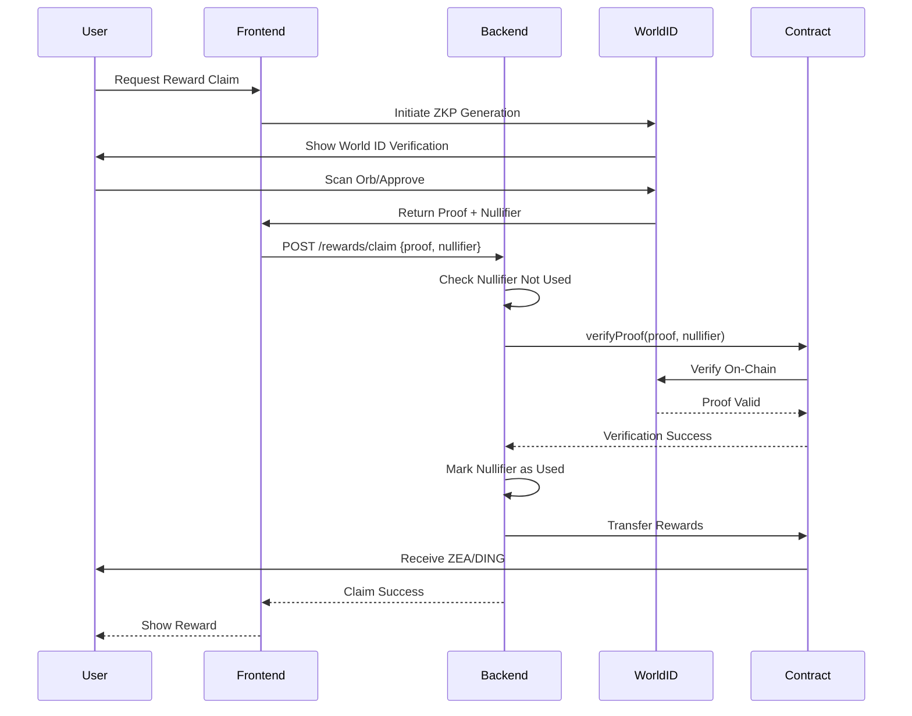

# ZeaZDev Architecture

## 🏛️ System Architecture

ZeaZDev is built on a **microservices-inspired monorepo architecture** with clear separation of concerns across multiple layers.

---

## 📐 High-Level Architecture

```
┌─────────────────────────────────────────────────────────────────┐
│                        CLIENT LAYER                              │
│  ┌──────────────┐  ┌──────────────┐  ┌──────────────┐          │
│  │   iOS App    │  │ Android App  │  │   Web App    │          │
│  │ (React Native)  │ (React Native) │(React Native Web)│       │
│  └──────────────┘  └──────────────┘  └──────────────┘          │
└─────────────────────────────────────────────────────────────────┘
                            ↓ REST API
┌─────────────────────────────────────────────────────────────────┐
│                      API GATEWAY LAYER                           │
│  ┌─────────────────────────────────────────────────────────┐   │
│  │           NestJS Backend (Port 3000)                     │   │
│  │  ┌─────────┐ ┌─────────┐ ┌─────────┐ ┌─────────┐       │   │
│  │  │  Auth   │ │  DeFi   │ │ Rewards │ │  Game   │       │   │
│  │  │ Module  │ │ Module  │ │ Module  │ │ Module  │       │   │
│  │  └─────────┘ └─────────┘ └─────────┘ └─────────┘       │   │
│  │  ┌─────────┐                                             │   │
│  │  │FinTech  │                                             │   │
│  │  │ Module  │                                             │   │
│  │  └─────────┘                                             │   │
│  │  ┌─────────┐                                             │   │
│  │  │ Bridge  │ Cross-Chain Module                          │   │
│  │  │ Module  │                                             │   │
│  │  └─────────┘                                             │   │
│  └─────────────────────────────────────────────────────────┘   │
└─────────────────────────────────────────────────────────────────┘
           ↓                    ↓                    ↓
┌──────────────────┐  ┌──────────────────┐  ┌──────────────────┐
│  MULTI-CHAIN     │  │   DATA LAYER     │  │  EXTERNAL APIS   │
│  ┌────────────┐  │  │  ┌────────────┐  │  │  ┌────────────┐  │
│  │ Optimism   │  │  │  │ PostgreSQL │  │  │  │  World ID  │  │
│  │ Polygon    │  │  │  │   (Prisma) │  │  │  │   Oracle   │  │
│  │ Arbitrum   │  │  │  └────────────┘  │  │  └────────────┘  │
│  │ Base       │  │  │  ┌────────────┐  │  │  ┌────────────┐  │
│  │  Bridge    │  │  │  │   Redis    │  │  │  │  Uniswap   │  │
│  │   Pools    │  │  │  │   Cache    │  │  │  │    V3      │  │
│  └────────────┘  │  │  └────────────┘  │  │  └────────────┘  │
└──────────────────┘  └──────────────────┘  │  ┌────────────┐  │
                                             │  │Thai Banks  │  │
                                             │  │ Marqeta    │  │
                                             │  └────────────┘  │
                                             └──────────────────┘
```

---

## 🌉 Cross-Chain Bridge Architecture

### Multi-Chain Infrastructure

```
┌─────────────────────────────────────────────────────────────┐
│                    L2 Network Ecosystem                      │
│                                                               │
│  ┌──────────┐  ┌──────────┐  ┌──────────┐  ┌──────────┐   │
│  │Optimism  │  │ Polygon  │  │ Arbitrum │  │   Base   │   │
│  │(Chain 10)│  │(Chain137)│  │(Chain    │  │(Chain    │   │
│  │          │  │          │  │ 42161)   │  │ 8453)    │   │
│  │ ZEA/DING │  │ ZEA/DING │  │ ZEA/DING │  │ ZEA/DING │   │
│  │  Bridge  │  │  Bridge  │  │  Bridge  │  │  Bridge  │   │
│  │   Pool   │  │   Pool   │  │   Pool   │  │   Pool   │   │
│  └────┬─────┘  └────┬─────┘  └────┬─────┘  └────┬─────┘   │
│       │             │               │             │          │
│       └─────────────┴───────────────┴─────────────┘          │
│                           │                                   │
│                 ┌─────────▼──────────┐                       │
│                 │  Bridge Relayers   │                       │
│                 │  (Authorized Only) │                       │
│                 └─────────┬──────────┘                       │
│                           │                                   │
│                 ┌─────────▼──────────┐                       │
│                 │  Backend Bridge    │                       │
│                 │     Service        │                       │
│                 │  - Quote Engine    │                       │
│                 │  - TX Monitoring   │                       │
│                 │  - LP Management   │                       │
│                 └─────────┬──────────┘                       │
│                           │                                   │
│                 ┌─────────▼──────────┐                       │
│                 │   Frontend UI      │                       │
│                 │  - Bridge Tab      │                       │
│                 │  - Liquidity Tab   │                       │
│                 └────────────────────┘                       │
└─────────────────────────────────────────────────────────────┘
```

### Bridge Transaction Flow

```
User Request (Bridge 1000 ZEA from Optimism to Polygon)
    ↓
Frontend: Select Source (Optimism) and Target (Polygon)
    ↓
Frontend: GET /bridge/quote?amount=1000&sourceChain=10&targetChain=137
    ↓
Backend: Calculate Fees
    - Bridge Fee: 1 ZEA (0.1%)
    - LP Fee: 0.5 ZEA (0.05%)
    - Amount After Fees: 998.5 ZEA
    ↓
Frontend: Display Quote to User
    ↓
User: Approve Transaction in Wallet
    ↓
User: Call initiateBridge() on Optimism Bridge Contract
    ↓
Smart Contract (Optimism):
    - Lock 1000 ZEA
    - Distribute 0.5 ZEA to LP holders
    - Emit BridgeInitiated Event
    ↓
Backend Relayer: Listen for BridgeInitiated Event
    ↓
Backend: POST /bridge/initiate
    - Create DB record
    - Status: PENDING
    ↓
Relayer: Verify Transaction on Source Chain
    ↓
Relayer: Call completeBridge() on Polygon Bridge Contract
    - Release 998.5 ZEA to User
    - Emit BridgeCompleted Event
    ↓
Backend: POST /bridge/complete
    - Update DB record
    - Status: COMPLETED
    ↓
Frontend: Poll GET /bridge/transaction/:hash
    ↓
Frontend: Show Success (1-3 minutes total time)
    ↓
User: Receives 998.5 ZEA on Polygon
```

### Liquidity Pool Economics

**LP Provider Flow**:
```
LP Provider: Add 10,000 ZEA to Polygon Pool
    ↓
Frontend: POST /bridge/liquidity/add
    ↓
Smart Contract:
    - Transfer 10,000 ZEA from Provider
    - Calculate LP Shares (1:1 if first LP)
    - Mint LP Shares to Provider
    - Add to totalLiquidity
    ↓
Provider Earns: 0.05% of all bridge transactions
    ↓
APR Calculation:
    - Daily Volume: 1M ZEA
    - Daily LP Fees: 500 ZEA (0.05% of 1M)
    - Annual LP Fees: 182,500 ZEA
    - Total Pool Liquidity: 5M ZEA
    - APR: (182,500 / 5,000,000) * 100 = 3.65%
    - With high volume: 15%+ APR achievable
```

**Fee Distribution**:
- 0.10% Bridge Fee → Protocol Treasury
- 0.05% LP Fee → Liquidity Providers (auto-compounded)

**Supported Networks**:
| Network | Chain ID | Bridge Time | Gas Cost |
|---------|----------|-------------|----------|
| Optimism | 10 | 1 minute | ~$0.10 |
| Polygon | 137 | 3 minutes | ~$0.05 |
| Arbitrum One | 42161 | 1 minute | ~$0.15 |
| Base | 8453 | 1 minute | ~$0.08 |

---

## 🔐 World ID ZKP Flow

### Architecture Pattern: Zero-Knowledge Proof Verification



### Key Components

**1. Nullifier Hash Tracking**
- Prevents double-claiming via unique identifiers
- Stored both on-chain (contract) and off-chain (database)
- Cannot be reverse-engineered to reveal identity

**2. Signal Hash**
- Binds proof to user's wallet address
- Ensures proof can only be used by intended recipient
- Calculated: `keccak256(walletAddress)`

**3. External Nullifier**
- Action-specific identifier (e.g., "daily-checkin", "airdrop")
- Allows same user to prove once per action type
- Calculated: `keccak256(ACTION_ID)`

**4. Merkle Root**
- Snapshot of verified humans in World ID system
- Updated periodically by World ID protocol
- Used to validate proof freshness

---

## 💱 DeFi Integration Architecture

### Uniswap V3 Swap Flow

```
User Input (Swap ZEA → ETH)
    ↓
Frontend: Get Quote
    ↓
Backend: /defi/swap/quote
    ↓
Uniswap Quoter Contract
    ↓ (estimated amountOut)
Backend Returns Quote
    ↓
User Confirms
    ↓
Frontend: Execute Swap (Web3)
    ↓
Uniswap Router Contract
    ↓ (swap executed)
Transaction Confirmed
    ↓
Backend: Record Transaction
    ↓
Database: Save Swap History
```

### Staking Architecture

**Contract Layer**:
```solidity
ZeaZStake {
    mapping(address => StakeInfo) stakes;
    
    function stake(amount) {
        // Transfer ZEA from user
        // Create/update stake record
        // Start earning rewards
    }
    
    function calculateRewards(user) {
        // APY calculation based on time
        // Returns pending rewards
    }
    
    function claimRewards() {
        // Calculate rewards
        // Mint new ZEA as rewards
        // Update lastClaimTime
    }
}
```

**Backend Layer**:
- Tracks stake history in PostgreSQL
- Provides aggregated statistics
- Handles off-chain notifications

**Frontend Layer**:
- Real-time APY display
- Auto-compound option (future)
- Stake/unstake UI

---

## 🏦 FinTech Bridge Design

### Thai Bank Integration Proxy

```
User Request (Deposit 1000 THB)
    ↓
Frontend: Initiate Deposit
    ↓
Backend: /fintech/bank/thai/deposit
    ↓
Thai Bank Proxy Service
    ↓
┌─────────────────────────────────┐
│  Thai Bank APIs (PromptPay)     │
│  - SCB Easy API                 │
│  - Kbank Open Banking           │
│  - BBL Developer Portal         │
└─────────────────────────────────┘
    ↓
Bank Confirms Transfer
    ↓
Backend: Create FintechTransaction
    ↓
Database: Save Transaction
    ↓
Backend: Mint Equivalent Crypto
    ↓
User Receives Crypto
```

### PromptPay QR Code Top-Up Flow

```
User: Click "Generate PromptPay QR"
    ↓
Frontend: POST /fintech/promptpay/generate
    ↓
Backend: Create Pending Transaction
    ↓
Backend: Generate EMV QR Code Payload
    ↓ (QR includes: PromptPay ID, Amount, Reference)
Frontend: Display QR Code
    ↓
User: Scan QR with Banking App
    ↓
User: Confirm Payment in Banking App
    ↓
Thai Bank: Process Payment
    ↓
Thai Bank: Send Webhook to Backend
    ↓
Backend: POST /fintech/promptpay/webhook
    ↓
Backend: Update Transaction Status
    ↓
Backend: Mint Equivalent Crypto
    ↓
Frontend: Poll GET /fintech/promptpay/verify/:id
    ↓
Frontend: Show Payment Success
    ↓
User: Receives Crypto in Wallet
```

**PromptPay Technical Details**:
- **Standard**: EMV QR Code format
- **PromptPay ID Types**: 
  - Phone Number (10 digits)
  - National ID (13 digits)
  - Tax ID (13 digits)
- **QR Expiry**: 15 minutes
- **Payment Verification**: Webhook + polling
- **Supported Banks**: All Thai banks (SCB, Kbank, BBL, KTB, TMB, etc.)
- **Transaction Limit**: Per bank policy (typically 50,000 THB/transaction)
- **Processing Time**: Instant (real-time)

### Card Issuance Flow

```
User: Apply for Card
    ↓
Frontend: /fintech/card/issue
    ↓
Backend: Verify World ID (ZKP)
    ↓
Backend: Check KYC Status
    ↓
Marqeta/Stripe API
    ↓
┌─────────────────────────────────┐
│  Card Issuer                    │
│  - Create User                  │
│  - Issue Card                   │
│  - Activate Card                │
└─────────────────────────────────┘
    ↓
Backend: Save Card Details
    ↓
Database: FintechUser Record
    ↓
User: Receives Virtual Card Immediately
User: Receives Physical Card in 7 days
```

**Security Measures**:
1. **KYC Verification**: World ID + document upload
2. **Spending Limits**: Configurable per user
3. **Fraud Detection**: Real-time monitoring
4. **3DS Authentication**: Required for online purchases
5. **Card Freeze**: Instant freeze via app

---

## 🎮 Game Architecture

### Unity WebGL ↔ React Native Bridge

```javascript
// React Native Side
const unityRef = useRef();

const playSlots = async (betAmount) => {
    // Send message to Unity
    unityRef.current.postMessage({
        action: 'PLAY_SLOTS',
        betAmount: betAmount,
        token: 'ZEA'
    });
};

// Listen for Unity responses
window.addEventListener('message', (event) => {
    if (event.data.outcome === 'won') {
        claimWinnings(event.data.winAmount);
    }
});
```

```csharp
// Unity Side (Web3Bridge.cs)
public void PlaySlots(string betAmount, string token) {
    // Game logic
    SpinSlots();
    
    // Send result back to RN
    string result = JsonUtility.ToJson(new {
        outcome = "won",
        winAmount = "500000000000000000000"
    });
    
    SendMessageToRN(result);
}
```

### Game Session Flow

```
User: Click "Play Slots"
    ↓
Frontend: Check Balance
    ↓
Frontend: Approve Token Spend (MetaMask)
    ↓
Backend: POST /game/slots/play
    ↓
Database: Create GameSession
    ↓
Frontend: Load Unity WebGL
    ↓
Unity: Execute Game Logic
    ↓
Unity: Generate Result (provably fair)
    ↓
Unity: Send Result to Frontend
    ↓
Frontend: POST /game/slots/complete
    ↓
Backend: Update GameSession
    ↓
Backend: Transfer Winnings (if won)
    ↓
Frontend: Display Result
```

---

## 🗄️ Database Schema Architecture

### Core Tables

**Users Table**:
```prisma
model User {
  id            String   @id @default(uuid())
  worldIdHash   String?  @unique      // ZKP nullifier
  walletAddress String   @unique
  email         String?  @unique
  
  stakes        Stake[]
  gameSessions  GameSession[]
  fintechUser   FintechUser?
  rewards       RewardClaim[]
  referrals     Referral[]
}
```

**Indexes for Performance**:
- `walletAddress` (primary lookup)
- `worldIdHash` (ZKP verification)
- `createdAt` (time-series queries)

### Caching Strategy (Redis)

**Cache Keys**:
- `user:${address}:balance` - Token balances (60s TTL)
- `user:${address}:stakes` - Stake info (30s TTL)
- `swap:quote:${hash}` - Swap quotes (10s TTL)
- `game:session:${id}` - Active sessions (300s TTL)

**Cache Invalidation**:
- On-chain events trigger cache clear
- Manual refresh on user action
- Background sync every 30s

---

## 🔒 Security Architecture

### Multi-Layer Security

**1. Smart Contract Layer**:
- OpenZeppelin battle-tested contracts
- Reentrancy guards on all state-changing functions
- Pausable tokens for emergency stops
- Access control via role-based permissions

**2. API Layer**:
- JWT authentication
- Rate limiting (100 req/min per IP)
- Input validation (class-validator)
- SQL injection prevention (Prisma ORM)
- CORS configuration

**3. Infrastructure Layer**:
- Docker container isolation
- Network segmentation
- Secrets management (env vars)
- Database encryption at rest
- TLS/SSL for all connections

**4. Application Layer**:
- World ID ZKP verification
- Nullifier hash tracking
- Transaction monitoring
- Anomaly detection

---

## 📈 Scalability

### Horizontal Scaling

**Backend**:
- Stateless API servers
- Load balancer (Nginx)
- Redis session store
- Auto-scaling based on CPU/Memory

**Database**:
- Read replicas for queries
- Write master for mutations
- Connection pooling (PgBouncer)
- Sharding by user ID (future)

**Blockchain**:
- Optimism L2 (low gas, high throughput)
- Batch transactions where possible
- Event indexing for fast lookups

---

**Last Updated**: 2025-11-08
**Version**: 1.0.0
