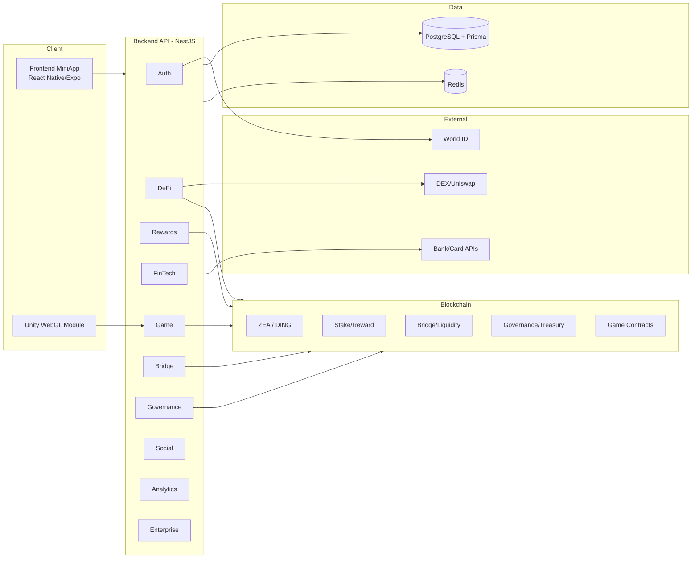

# ZeaZDev-Omega Full Manual, Blueprint, and Delivery Roadmap (EN/TH)

> Version: 1.0 (Generated on 2026-03-28 UTC)  
> Scope: Full-repo review for architecture understanding, implementation planning, operations, and compliance-ready execution.

---

## 1) Executive Summary (EN)

ZeaZDev-Omega is a monorepo super-app platform combining DeFi, GameFi, FinTech, cross-chain bridge, governance, social, analytics, and enterprise modules. The stack is structured into:

- **Apps layer**: React Native/Expo miniapp + NestJS backend.
- **Protocols layer**: Solidity smart contracts (tokens, rewards, staking, governance, gaming, bridge).
- **Data layer**: PostgreSQL (Prisma) + Redis.
- **DevOps layer**: Docker Compose, pnpm workspaces, Turbo pipelines.

The repository already contains broad feature scaffolding and domain models. For production in 2026, priorities are:

1. Runtime hardening and secure defaults.
2. Deterministic CI/CD with SBOM + vulnerability gates.
3. Controlled rollout and observability.
4. Compliance-ready evidence trails and policy-driven workflows.

---

## 2) สรุปผู้บริหาร (TH)

ZeaZDev-Omega เป็นแพลตฟอร์มแบบ monorepo ที่รวม DeFi, GameFi, FinTech, Bridge ข้ามเชน, Governance, Social, Analytics และ Enterprise ไว้ในระบบเดียว โดยแบ่งชั้นสถาปัตยกรรมเป็น:

- **ชั้นแอปพลิเคชัน**: React Native/Expo miniapp + NestJS backend
- **ชั้นโปรโตคอล**: Smart Contract (token/reward/stake/governance/game/bridge)
- **ชั้นข้อมูล**: PostgreSQL (Prisma) + Redis
- **ชั้น DevOps**: Docker Compose, pnpm workspaces, Turbo

รีโปนี้มีโครงสร้างและโมดูลค่อนข้างครบในระดับ scaffold แล้ว แต่หากจะใช้งาน production ในปี 2026 ควรเร่ง:

1. Harden runtime และตั้งค่า secure-by-default
2. ทำ CI/CD แบบ deterministic พร้อม SBOM + vulnerability gates
3. เสริมระบบ monitoring/alerting/traceability
4. จัดทำหลักฐาน compliance เพื่อ audit ได้จริง

---

## 3) Repository Map (EN)

## Top-level
- `apps/backend`: NestJS API modules.
- `apps/frontend-miniapp`: React Native/Expo client with EN/TH i18n.
- `packages/contracts`: Hardhat + Solidity contracts.
- `packages/game-unity`: Unity scripts for game bridge.
- `docs/`: additional project documentation.

## Backend module coverage
- Auth (World ID)
- DeFi
- Rewards
- FinTech
- Game
- Governance
- Bridge
- Social
- Analytics
- Enterprise

## Smart-contract domain coverage
- Core tokens (`ZeaToken`, `DingToken`)
- Rewards and staking
- Bridge and liquidity bridge
- Governance + treasury
- Game contracts (slot/poker/roulette/sports)
- TradFi bridge interface

---

## 4) แผนที่รีโป (TH)

## โครงสร้างหลัก
- `apps/backend`: โมดูล API ฝั่งเซิร์ฟเวอร์ (NestJS)
- `apps/frontend-miniapp`: แอปมือถือ/web แบบ Expo พร้อม i18n EN/TH
- `packages/contracts`: Smart contract ด้วย Hardhat/Solidity
- `packages/game-unity`: โค้ด Unity bridge
- `docs/`: เอกสารประกอบโปรเจกต์

## โมดูล backend ที่มี
- Auth, DeFi, Rewards, FinTech, Game, Governance, Bridge, Social, Analytics, Enterprise

## ขอบเขต contract ที่รองรับ
- Token หลัก, staking/reward, governance/treasury, bridge/liquidity, game contracts, TradFi bridge

---

## 5) System Blueprint (EN)



---

## 6) พิมพ์เขียวระบบ (TH)

แนวคิดหลักคือ **แยก concern ชัดเจน** ระหว่าง client, API, data และ blockchain เพื่อให้ scale และ audit ได้ง่าย โดย API เป็น orchestration center ที่เชื่อมต่อ:

- Identity proof (World ID)
- DeFi/trading
- Game events และ reward
- FinTech operation
- Governance และ bridge operation

---

## 7) Delivery Blueprint & Workstreams (EN)

## Workstream A: Platform Reliability
- Add health/readiness/liveness checks per service.
- Standardize env validation on startup.
- Add retries/circuit breakers for external APIs.

## Workstream B: DevSecOps 2026 Baseline
- Generate SBOM at build.
- Add SAST + dependency scan + container scan.
- Enforce signed artifacts and immutable release metadata.

## Workstream C: Compliance-Ready Controls
- Structured audit logging (actor/action/resource/result).
- Data retention and PII handling policy map.
- Access control matrix and evidence exports.

## Workstream D: Productization
- One-click installer profiles (local/dev/staging/prod).
- Menu-driven operations scripts.
- Rollback playbooks and recovery runbooks.

---

## 8) แผนปฏิบัติการ (TH)

## สายงาน A: เสถียรภาพระบบ
- เพิ่ม endpoint ตรวจสุขภาพระบบ (health/readiness/liveness)
- ตรวจสอบ env ตอนเริ่มระบบแบบ fail-fast
- ใส่ retry/circuit breaker สำหรับบริการภายนอก

## สายงาน B: DevSecOps 2026
- สร้าง SBOM อัตโนมัติทุก build
- เพิ่มการสแกน SAST/dependency/container
- บังคับใช้ signed artifacts และ metadata ที่ย้อนรอยได้

## สายงาน C: Compliance
- ทำ structured audit log ทุก transaction สำคัญ
- กำหนด data classification และ retention policy
- จัดทำ evidence export สำหรับ audit

## สายงาน D: Productization
- installer แบบ one-click แยก profile
- สคริปต์เมนูสำหรับทีมปฏิบัติการ
- playbook rollback/recovery พร้อมใช้งานจริง

---

## 9) Deterministic Workflow (Pseudo-code, EN)

```text
BOOTSTRAP():
  validate_runtime(node,pnpm,docker)
  load_env_and_validate_required_vars()
  start_dependencies(postgres,redis)
  migrate_database()
  build_contracts_and_apps()
  run_smoke_tests()

DEPLOY_PIPELINE(env):
  checkout_exact_tag()
  verify_lockfiles_and_checksums()
  generate_sbom()
  run_security_scans()
  block_if_policy_violations()
  deploy_backend_frontend_contracts(env)
  run_post_deploy_healthchecks()
  publish_release_metadata()

AUTOHEAL_LOOP():
  while service_running:
    if healthcheck_failed:
      restart_component_with_backoff()
      if repeated_failure_threshold_hit:
        trigger_rollback_and_alert()
```

---

## 10) เวิร์กโฟลว์เชิงกำหนดแน่นอน (Pseudo-code, TH)

```text
เริ่มระบบ():
  ตรวจ runtime ให้ตรงเวอร์ชัน
  โหลด env และตรวจค่าบังคับ
  เปิดฐานข้อมูล/แคช
  migrate schema
  build โมดูลทั้งหมด
  รัน smoke test

deploy(env):
  ดึง source ตาม tag ที่ล็อกไว้
  ตรวจ lockfile/checksum
  สร้าง SBOM
  สแกนความปลอดภัย
  ถ้าผิด policy ให้หยุด pipeline
  deploy ทุกส่วนตามลำดับ
  ตรวจสุขภาพหลัง deploy
  บันทึก release metadata

autoheal():
  วนตรวจ healthcheck
  ถ้าล้มเหลวให้ restart แบบ backoff
  ถ้าล้มเหลวซ้ำเกิน threshold ให้ rollback และแจ้งเตือน
```

---

## 11) Manual: Setup & Operations (EN)

## Local setup
1. Install Node.js >= 18 and pnpm >= 8.
2. Install Docker and Docker Compose.
3. `pnpm install` at repository root.
4. Start infra (`docker compose up -d`).
5. Run backend/frontend/contracts commands as needed.

## Suggested command profile
- Workspace dev: `pnpm dev`
- Build all: `pnpm build`
- Test all: `pnpm test`
- Lint all: `pnpm lint`
- Contract compile: `pnpm contracts:compile`

## Operational checks
- DB connectivity, migration status
- Redis connectivity/auth
- Contract network configuration sanity
- External integration toggles for non-prod

---

## 12) คู่มือการใช้งานและปฏิบัติการ (TH)

## การติดตั้งแบบ local
1. ติดตั้ง Node.js >= 18 และ pnpm >= 8
2. ติดตั้ง Docker + Docker Compose
3. รัน `pnpm install` ที่ root
4. เปิดบริการฐานข้อมูล/แคช
5. รันคำสั่ง dev/build/test ตามโมดูล

## รายการตรวจสอบระหว่างปฏิบัติการ
- สถานะ migration ของฐานข้อมูล
- การเชื่อมต่อ Redis และ credential
- ความถูกต้องของ network config สำหรับ contract
- ปิด/เปิด integration ภายนอกตามสภาพแวดล้อม

---

## 13) Security & Compliance Checklist (EN/TH)

- [ ] Secret management via vault/managed secret store (ไม่เก็บ secret จริงใน repo)
- [ ] Least-privilege IAM and service account scoping (สิทธิ์เท่าที่จำเป็น)
- [ ] API rate limiting + WAF + bot protection
- [ ] End-to-end structured audit logs with tamper evidence
- [ ] SBOM generation on each release
- [ ] Dependency + container + IaC vulnerability scans
- [ ] Contract audit and formal verification plan for critical contracts
- [ ] DR plan + backup/restore drills with RPO/RTO targets
- [ ] Privacy and data-retention controls mapped per table/domain
- [ ] Incident response runbook and breach-notification workflow

---

## 14) 12-Month Roadmap (EN)

## Q2 2026
- Stabilize core runtime, clean env validation, complete observability foundation.
- Add CI security gates (SBOM/SAST/dependency scan).

## Q3 2026
- Harden bridge and fintech integration with policy-based risk controls.
- Release first compliance evidence pack generator.

## Q4 2026
- Productionize DAO/governance lifecycle with monitoring and fraud analytics.
- Add deterministic release train with signed artifacts.

## Q1 2027
- Expand enterprise SDK/plugin maturity and support multi-tenant controls.
- Achieve audit-ready posture with repeatable control testing.

---

## 15) โรดแมป 12 เดือน (TH)

## Q2 2026
- เพิ่มเสถียรภาพระบบหลัก และวาง observability ให้ครบ
- ใส่ security gates ใน CI/CD (SBOM/SAST/Dependency)

## Q3 2026
- Harden bridge + fintech ด้วย risk controls
- ออกระบบสร้าง compliance evidence pack รุ่นแรก

## Q4 2026
- ทำ governance/DAO ให้พร้อม production
- ทำ release pipeline แบบ deterministic + signed artifact

## Q1 2027
- ขยาย enterprise SDK/plugin และ multi-tenant controls
- เข้าสู่ระดับ audit-ready ที่ตรวจซ้ำได้

---

## 16) Gaps Identified from Repo Review (EN)

1. **No centralized runbook** combining architecture + ops + compliance in one place (this document fills that gap).
2. **Docker port mapping appears non-default** (`5433:5433`, `6380:6380`), requiring explicit service-side port config checks before runtime.
3. **Documentation fragmentation** across many phase files can slow onboarding.
4. **Evidence automation (SBOM/audit exports)** is not clearly wired into scripts yet.

---

## 17) ช่องว่างที่พบจากการรีวิวรีโป (TH)

1. ยังไม่มีคู่มือศูนย์กลางที่รวม architecture + operations + compliance ในไฟล์เดียว
2. ค่า port ใน Docker ตั้งแบบไม่ใช่ default ทั่วไป ต้องตรวจซ้ำ config runtime
3. เอกสารกระจายหลายไฟล์ ทำให้ onboarding ช้าสำหรับทีมใหม่
4. automation สำหรับหลักฐาน audit/SBOM ยังไม่เห็นเชื่อมกับ pipeline ชัดเจน

---

## 18) Recommended Next Artifacts (EN/TH)

1. `docs/RUNBOOK_PROD.md` (incident + rollback + escalation).  
2. `docs/COMPLIANCE_CONTROL_MATRIX.md` (control, owner, evidence, frequency).  
3. `.github/workflows/security-release.yml` (SBOM + scanning + signed release).  
4. `scripts/preflight.sh` and `scripts/autoheal.sh` (deterministic runtime checks).  
5. `docs/ONBOARDING_QUICKSTART_TH_EN.md` (1-hour team onboarding).

---

## 19) Quick Glossary (TH/EN)

- **Deterministic**: ผลลัพธ์ซ้ำได้เหมือนเดิมจาก input เดิม
- **SBOM**: รายการส่วนประกอบซอฟต์แวร์เพื่อ trace supply chain
- **Zero Trust**: ไม่เชื่อถือโดยปริยาย ต้องพิสูจน์ตัวตน/สิทธิ์ทุกครั้ง
- **Autoheal**: กลไกกู้คืนอัตโนมัติเมื่อบริการล้มเหลว
- **Evidence Pack**: ชุดหลักฐานสำหรับการตรวจสอบ compliance/audit

---

## 20) Document Use Policy

- This document is the **single bilingual onboarding baseline**.
- Keep architecture/runtime/security sections updated per release.
- Link each future phase document back to this manual.
